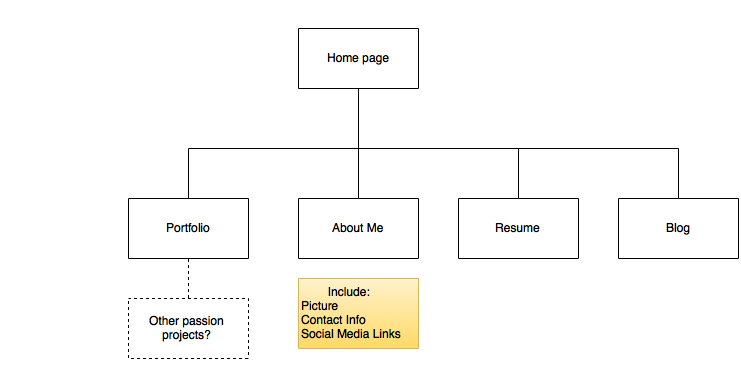

# Phase 0 Section 2.3 Introduction to design

## This section introduced the concept of sitemaps and content planning

## draw.io used to create site map png file

###What are the 6 Phases of Web Design?
The six phases of web design are:

1. Information gathering: Who, what and why?
2. Planning: What technoligies are needed (shopping cart, payment processor, CMS?), information flow and site maps
3. Design: Wireframes and prototyping, UX
4. Development: More UX and building the web site
5. Testing and Delivery
6. Maintenance

###What is your site's primary goal or purpose? What kind of content will your site feature?
The purpose of my site is to demonstrate my abilities to audiences looking for a collaborator or assistance with web development. The site will include a portfolio of work, contact information, as well as some additional content such as a resume or "passion projects" section to demonstrate other interests (finance, creative) and soft skills.

###What is your target audience's interests and how do you see your site addressing them?
My target audience will be recruiters, entrepreneurs, and potential collaborators looking for a well-rounded developer to freelance or work alongside a small team. I am narrowing my audience to those who are either working in fintech or need a partner who can handle the tech and finance part of a business while they manage sales and marketing.

###What is the primary "action" the user should take when coming to your site? Do you want them to search for information, contact you, or see your portfolio? It's ok to have several actions at once, or different actions for different kinds of visitors.
I would like them to first click on my About Me page. I am considering doing a visual infograph to demonstrate various skills and experience levels. From the About me, I would then want them to either contact me or go to the portfolio page if they would like specific examples of my work.

###What are the main things someone should know about design and user experience?
Design and user experience is not necessarily about aesthetics. While aesthetics are a component of design and UX, the main purpose of good design and UX is to make complex systems accessible, and to design around the user's needs, as opposed to primarily focusing on what information the owner wants to put out. UX should consider how a user will move through the site, interact with the site. A strong UX will drive the customer to come back.

###What is user experience design and why is it valuable?
User Experience design describes (in this context) the human-computer interaction, and whether it's been created around the user to create an enjoyable experience that will attract and retain the user. It is valuable because a user is going to prefer spending resources on a product that they enjoy using versus a product that may have all of the desired features and information, but is frustrating to use. For a product to be successful, it needs to retain users, and a poor UX design can prevent retention.

###Which parts of the challenge did you find tedious?
I found the markup of the site map tedious as the relative path would not work unless I copied the pathname from GitHub and then modified it in the markup file, even when there were no differences compared to when I wrote the path out manually. Other students had identical issues, but none of us have been successful in determining what the error was.