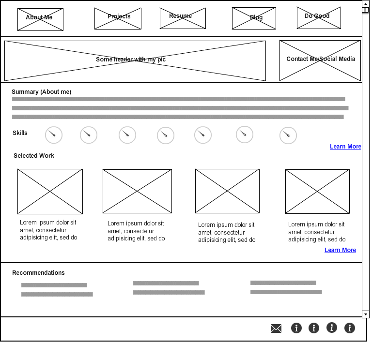
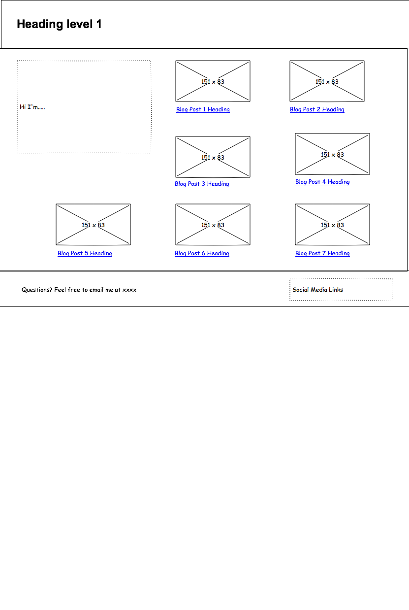

# Phase 0 Section 2.4 Reflection

## Wireframe Release 1: Site's Index

## Wireframe Release 2: Blog Template

##What is a wireframe?
A wireframe is a sketch that shows the layout of an application. It can be done by hand, using a sketching tool, or using the various wireframing tools available online.

##What are the benefits of wireframing?
The benefits of wireframing come down to the ability to mock up a sketch quickly. This helps in visualizing the site plan, and allows for quick iterations based on feedback and testing. It also helps to communicate the vision to your client and users before investing a lot of time and resources into the design.

##Did you enjoy wireframing your site?
I did enjoy it! Finding a good opensource tool was difficult, although I did like mockflow and could see myself using it once I start having to prototype regularly. I definitely got sucked into the rabbit hole in designing my index page... Should have used pomodoro.

##Did you revise your wireframe or stick with your first idea?
For my blog page, there were not a lot of features and I knew what I wanted to do from the start, so I didn't have to move much around.

I revised the wireframe for my index page quite a bit. I know that my assets in selling my abilities are going to be a combination of my development work plus my other experiences and technical/soft skills, and I thought that if a potential client or recruiter first landed on my page and started with my projects, they would be less inclined to continue looking.

##What questions did you ask during this challenge? What resources did you find to help you answer them?
My main question was what would a potential client or recruiter be looking for when they reach out to me? While the technical skills are great and important, from my experience, I have been more inclined to connect with someone if I can see some of their personality, believe that they are friendly and work well with others, can communicate, and are able to think big picture and grasp concepts. So I decided that I should have links to some features projects on the home page, but I should also have a brief visual on some of my other skills, and some information about my interests, in order to paint a better picture of myself.

My second question was what tool to use for wireframing. I went through the list provided in Canvas, but many of the pricing structures have changed. Mockup was great, but was limited to one project.

I then googled some other tools, and was reminded of PencilProject from a list on Mashable. I had used this tool before and liked how quick and easy it was to create a simple sketch diagram, so went ahead with that product for the blog sketch. It isn't as clean as the MockUp sketch, but it was much faster to use.

##Which parts of the challenge did you enjoy and which parts did you find tedious?
I enjoyed this challenge because it was satisfying to have produced the image files at the end of each project. I thought that some of the articles were a bit repetitive, and they weren't as helpful in how to communicate with the users to understand the needs. They emphasized that you have to make the experience memorable for the user, but left it up to you to figure out how. While I understand that design cannot be automated, more examples of how other designers/developers went about working with users to plan their initial prototypes would have been nice so that we could learn by example.
