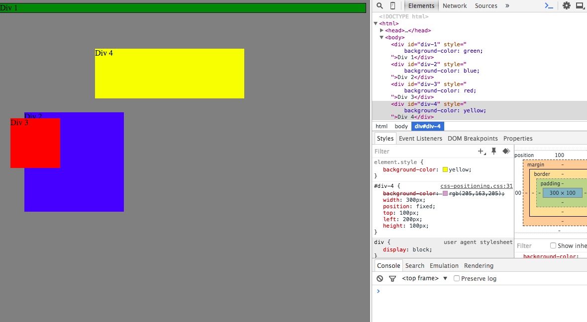
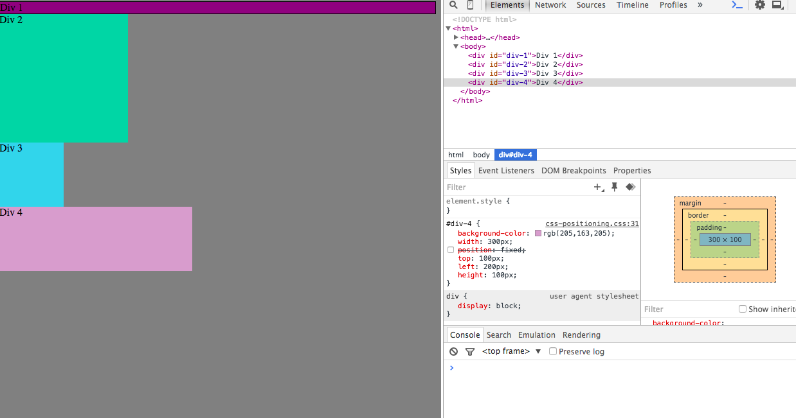
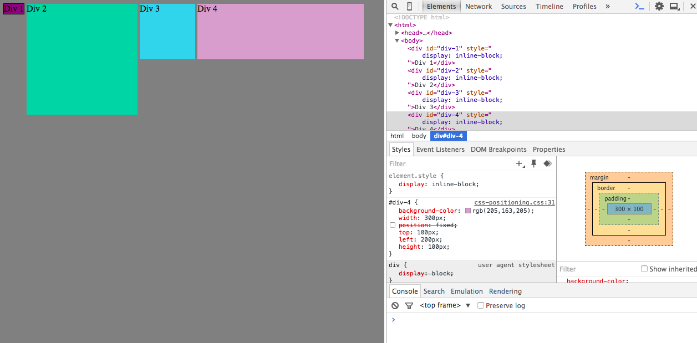
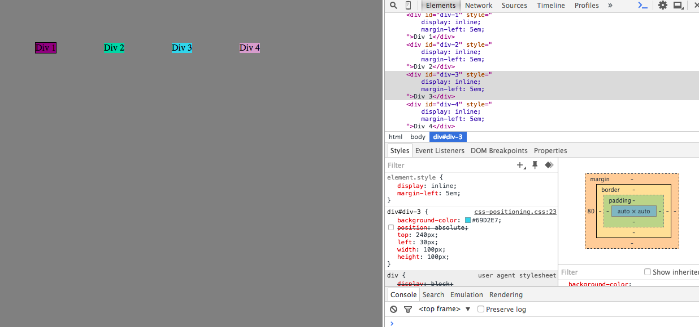
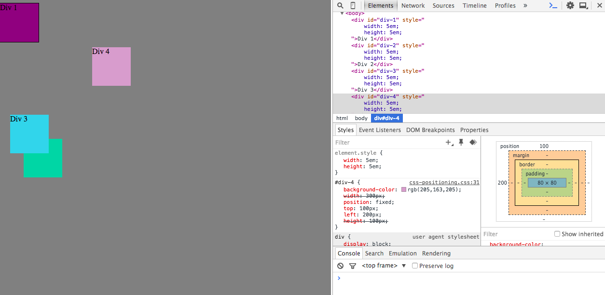
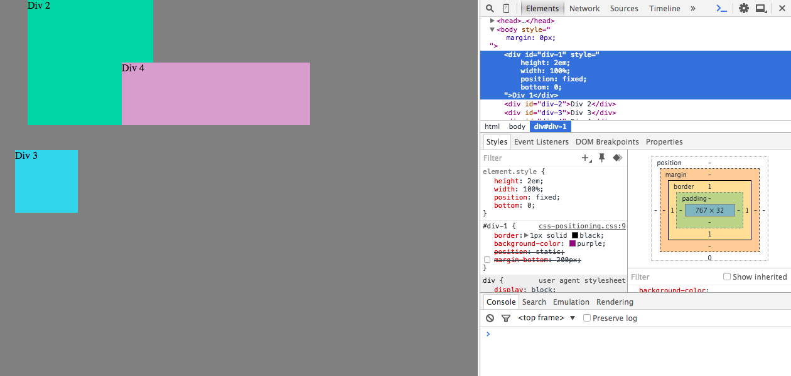
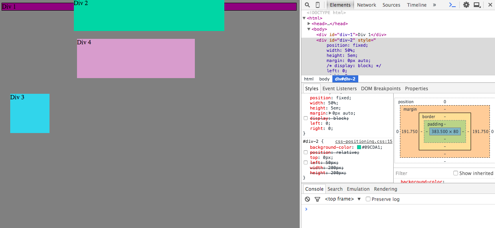
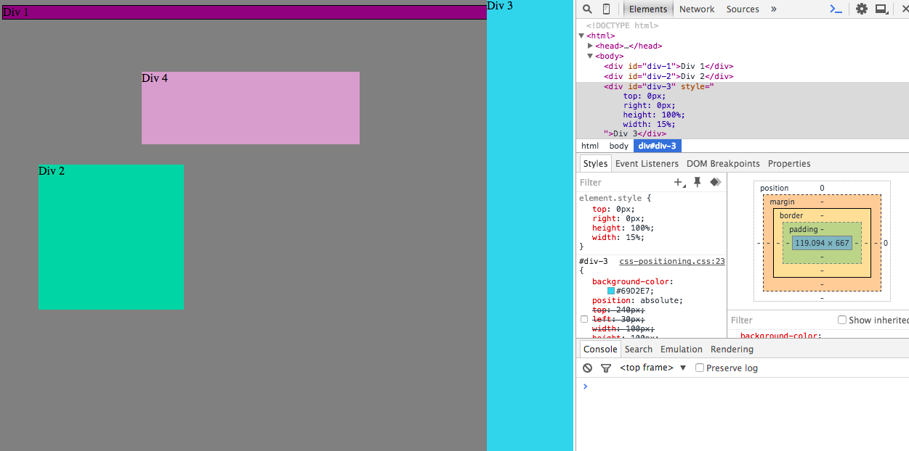
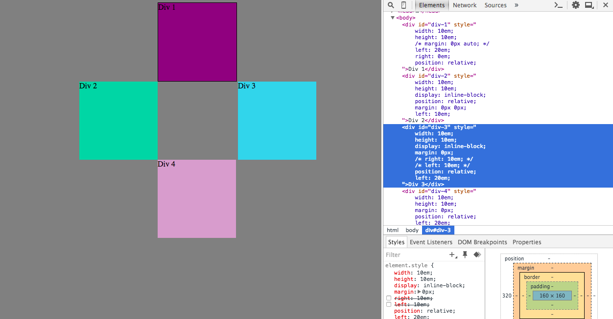

#Section 3.4 Chrome Dev Tools

##Release 3

### Change the Colors
Change the background-color of the boxes.

### Column
Stack the elements in top of one another without any space between them (in order)

### Row
Put the boxes in a row. Have the boxes that have size dimensions defined keep their original shape and size

### Make Equidistant
Put the boxes in a row. The sizes should be identical automatically. Put 5em of distance between them. Then add 5em from the top of the page.

### Squares
Resize the boxes so they are squares.

### Footer
Make div-1 a footer. Make the height 2em, the width 100% of the screen (Get rid of that annoying gray to the left). Then move it to the bottom of the page.

### Header
Now move div-2 to the top of the page and make it 5em tall. It should always be at the top of the browser window. Make the width 50% of the entire screen and center it.

### Sidebar
Move div-3 to the right so it looks like a right sidebar it should be 15% the width of the screen and 100% of the height of the viewer window. You'll want to get help from Google on this one.

### Get Creative

